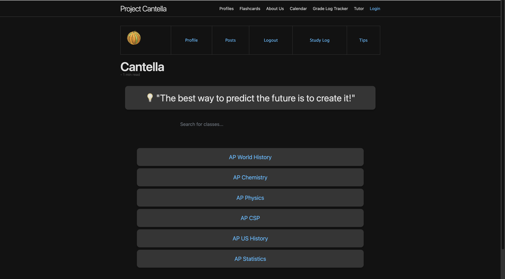
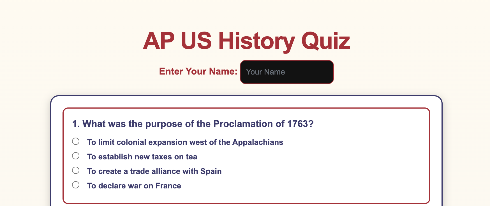
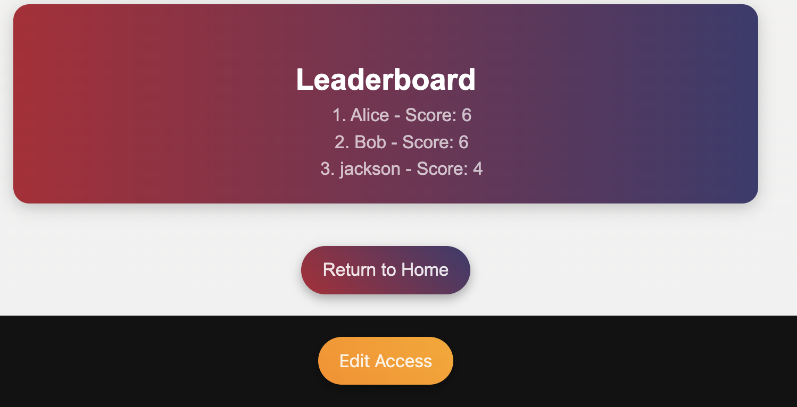
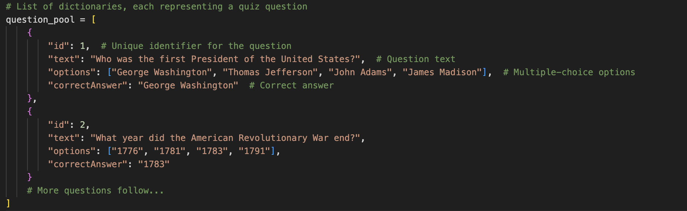
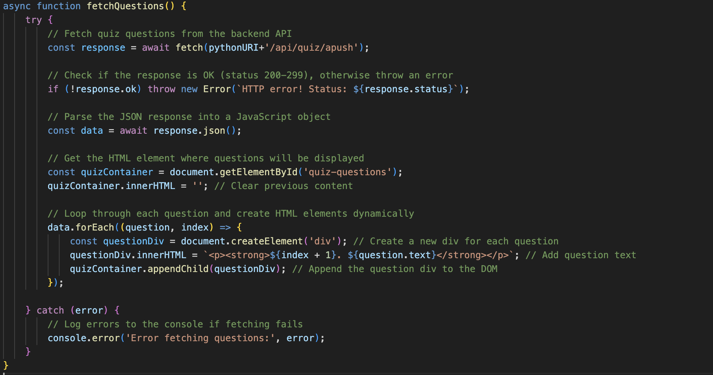
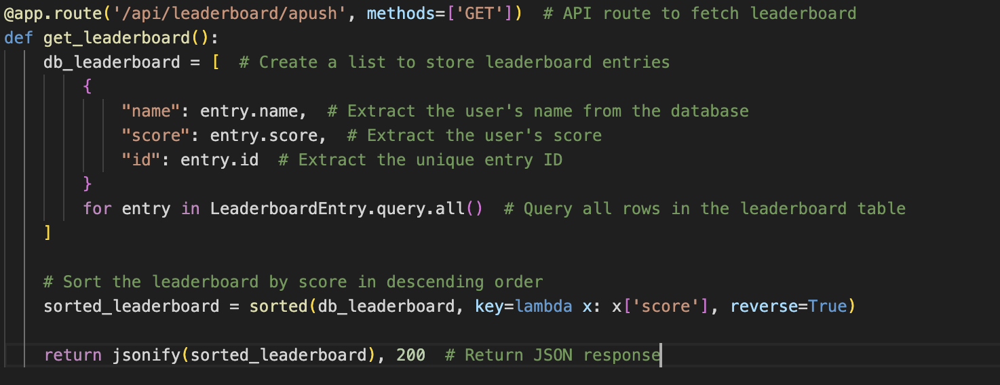
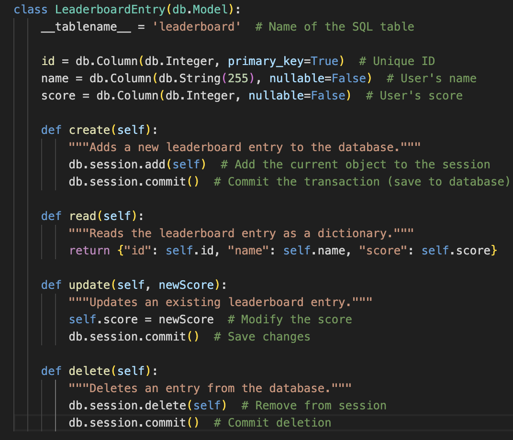
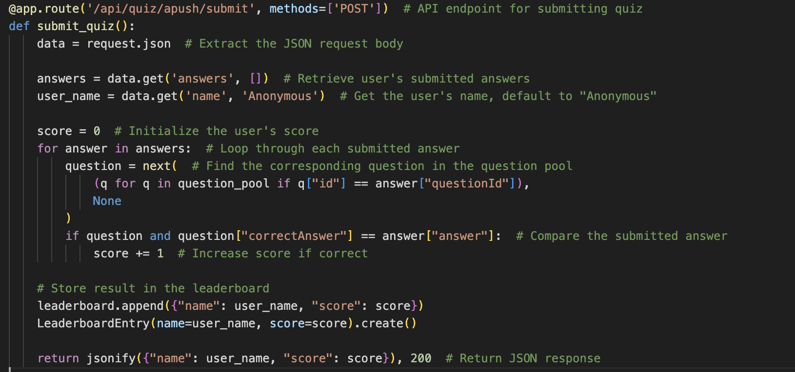

# Cantella: A Smarter Way to Study

Cantella is a study platform designed to help students prepare for AP tests and classes in general. Our website provides tools like **flashcards, study logs, and quizzes** to help users track their progress and reinforce their learning.

## Features  
- 📚 **Flashcards** – Users can create and review flashcards to memorize key concepts.  
- 📝 **Study Logs** – A personal study tracker to keep students accountable.  
- 🎯 **Quizzes & Dynamic Scoring** – A competitive quiz system that saves user scores dynamically.  

## My Contribution: Competitive Quiz System  
My primary role in this project was designing and implementing the **quiz system with dynamic scoring**:  

- ✅ **Quiz Functionality** – Users take quizzes on different subjects and receive scores instantly.  
- 🔄 **Score Saving** – Scores are saved dynamically to the backend, allowing users to track progress over time.  
- 🏆 **Competition & Leaderboard** – Users can compete for top scores, making studying more engaging.  

---

## How the System Works (Frontend & Backend Overview)

### **1️⃣ Frontend (User Side)**
- The user **opens the quiz page**, which **fetches questions** from the backend.  
- **JavaScript fetches** quiz data from the API and **injects it into the DOM** dynamically.  
- After answering, the **user submits responses**, which are sent to the backend via an API request.  
- The leaderboard is **updated dynamically** using another API request.  

### **2️⃣ Backend (Flask & Database)**
- **Flask API serves quiz questions** randomly from a predefined list.  
- The API **processes quiz submissions**, checking answers against the correct ones.  
- **Scores are saved** to the database using SQLAlchemy ORM.  
- The **leaderboard API retrieves stored scores**, allowing users to see rankings.  

### **3️⃣ Database (SQLAlchemy & Persistence)**
- Stores **user scores** in a structured format.  
- Provides **CRUD operations** for leaderboard management.  
- Uses **queries** to extract leaderboard data and send it back to the frontend.  

---

# Cantella Front Page

# Quiz Example

# Leaderboard Example

---

# Using Lists, Dictionaries, and Databases in an APUSH Quiz API  

## **1. Use of Lists, Dictionaries, and Databases**
### Explanation:
- **Lists** store multiple related objects (e.g., a pool of quiz questions).  
- **Dictionaries** structure data within a list, using key-value pairs.  
- **Databases** store persistent data (e.g., leaderboard scores) with SQLAlchemy ORM.  

### Example: List of Quiz Questions

- `question_pool` is a **list**, storing multiple quiz questions.  
- Each question is a **dictionary**, containing:  
  - **`id` (integer)** → Identifies the question.  
  - **`text` (string)** → The actual question.  
  - **`options` (list)** → Multiple-choice answers.  
  - **`correctAnswer` (string)** → The correct response.  

---

## **2. Formatting API Response Data (JSON) into the DOM**
### Explanation:
- **Flask returns JSON responses**, which the frontend processes.  
- **JavaScript fetches** data from the API and **dynamically injects it into the webpage**.  

### Example: Fetching Questions & Injecting into DOM

- Fetches **JSON data** from `/api/quiz/apush`.  
- Loops through the returned list and **injects each question** into the DOM.  
- Uses `.innerHTML` to **display data dynamically**.  

---

## **3. Extracting a Python List (Rows) from the Database**
### Explanation:
- **Database queries** return multiple records, structured as a **list**.  
- **SQLAlchemy’s `.query.all()`** fetches all rows from a table.  

### Example: Getting the Leaderboard

- `LeaderboardEntry.query.all()` **fetches all rows**.  
- **List comprehension** converts database rows into dictionaries.  
- `sorted()` **arranges scores in descending order**.  

---

## **4. CRUD Operations in a Class**
### Explanation:
- **Classes define methods** to **Create, Read, Update, and Delete (CRUD) records**.  
- **SQLAlchemy ORM methods** handle all database interactions.  

### Example: Leaderboard Model with CRUD Methods

- Defines methods to **create()**, **read()**, **update()**, and **delete()**.  
- Uses **SQLAlchemy ORM functions** to interact with the database.  

---

## **5. Handling an API Request**
### Explanation:
- **Endpoints receive data via requests** (e.g., `POST` submission).  
- **Algorithms process the data** (e.g., grading a quiz).  

### Example: Submitting a Quiz

- **Extracts submitted answers** from `request.json`.  
- **Loops through answers** and compares them with the correct ones.  
- **Stores the result** in the database.  

---

## **Covered Bullet Points (Check for Completeness) ✅**  

✅ **Use of lists, dictionaries, and databases**  
✅ **Code descriptions of where lists (rows) & dictionaries (columns) are used**  
✅ **Formatting JSON API response into the DOM**  
✅ **Extracting Python list (rows) using a database query**  
✅ **Using a 3rd-party library (SQLAlchemy) to fetch rows**  
✅ **Methods in a class (CRUD: create, read, update, delete)**  
✅ **Algorithmic code request (how the quiz is graded)**  
✅ **API class performing GET, POST, PUT, DELETE requests**  
✅ **Method containing sequencing, selection, iteration (quiz processing)**  
✅ **Parameters (request body) & return type (`jsonify` response)**  
✅ **Call to an algorithm (fetching quiz data)**  
✅ **Calling a method with an algorithm (`fetch()` request to endpoint)**  
✅ **Handling the return/response from the method (`fetch` processing JSON)**  
✅ **How changing data/methods trigger different responses (normal & error cases)**  

---

## **Final Notes**
This blog provides a **detailed breakdown** of how **frontend, backend, and database** components interact. 🚀  

✅ **Markdown is fully formatted for GitHub Pages**.  
✅ **No unnecessary code blocks—only explanations + images**.  
✅ **Bullet points fully covered for technical depth**.  

