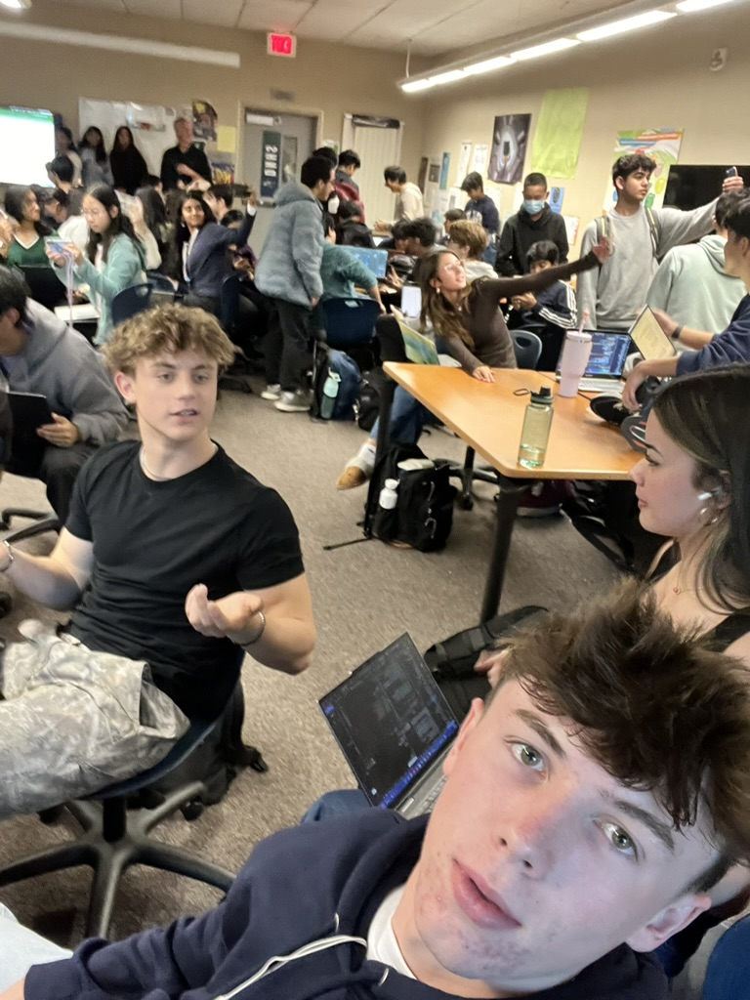

<html lang="en">
<head>
  <meta charset="UTF-8">
  <meta name="viewport" content="width=device-width, initial-scale=1.0">
  <title>Applying Success Tips in AP CSP</title>
  
</head>
<body>
  

    <h1>Applying Success Tips in AP CSP</h1>
    

      
<strong>Key Insight:</strong> I’ve learned that success in AP CSP comes from planning, clarity, and collaboration. Here’s how I plan to apply these lessons in Sprint 4, Sprint 5, and beyond.

    

  <h2>1. Planning with Visual Tools and VS Code</h2>
    
In the next sprint, I’ll prioritize planning before diving into code. For example:

    <ul>
      <li>Use tools like Kanban boards in Trello to outline tasks for my team.</li>
      <li>Create flowcharts to map out the logic of my code before writing it in VS Code.</li>
      <li>Break down larger tasks into smaller, manageable steps during team discussions.</li>
    </ul>
    
This will help ensure I stay organized and aligned with my team’s goals.

  <h2>2. Writing Clear and Commented Code</h2>
    
While coding in VS Code, I’ll focus on writing concise comments to explain each part of the code. This will help me:

    <ul>
      <li>Understand my own work when debugging or revisiting it later.</li>
      <li>Communicate my logic effectively to teammates during code reviews.</li>
      <li>Ensure the teacher understands my thought process during evaluations.</li>
    </ul>
    
For instance, I’ll use comments to explain my functions, data structures, and API calls step-by-step.

  <h2>3. Collaborating Effectively in Sprints</h2>
    
In Sprint 5, I plan to enhance teamwork by:

    <ul>
      <li>Scheduling regular check-ins to ensure the team is on track.</li>
      <li>Sharing my ideas early and inviting feedback during planning sessions.</li>
      <li>Using GitHub for version control and team collaboration on our project files.</li>
    </ul>
    
This will help us avoid miscommunication and keep everyone aligned on the project’s objectives.

  <h2>4. Learning Through Debugging and Iteration</h2>
    
I’ve realized that mistakes are part of the process. During the upcoming sprints, I’ll:

    <ul>
      <li>Use VS Code’s debugger to step through my code and identify errors.</li>
      <li>Reflect on the causes of bugs and document solutions to avoid repeating them.</li>
      <li>Iterate on my code by implementing small changes and testing frequently.</li>
    </ul>
    
This will help me refine my skills and create a more polished final product.

   <h2>5. Staying Focused and Concise</h2>
    
One key takeaway is the importance of being concise when explaining my code. To practice this, I’ll:

    <ul>
      <li>Prepare brief explanations of my code for sprint reviews and evaluations.</li>
      <li>Ensure that my comments and code are straightforward and to the point.</li>
    </ul>
    
Being concise will demonstrate that I truly understand my work.

  <h2>Final Thoughts</h2>
    
By applying these lessons in the remaining sprints, I’m confident that I’ll grow as a programmer and collaborator. My focus will be on planning effectively, collaborating with my team, and continuously learning through the process.

  

  
</body>
</html>
