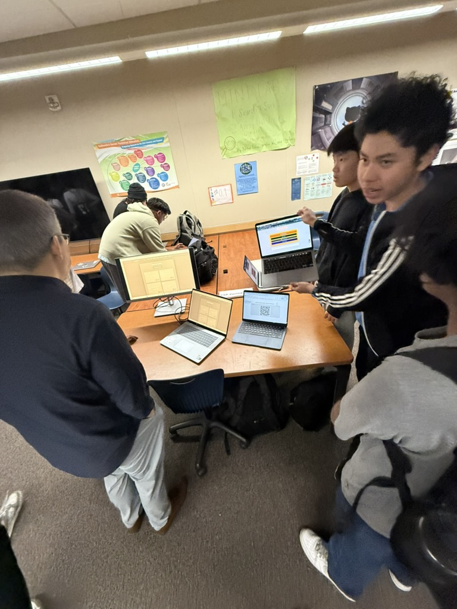
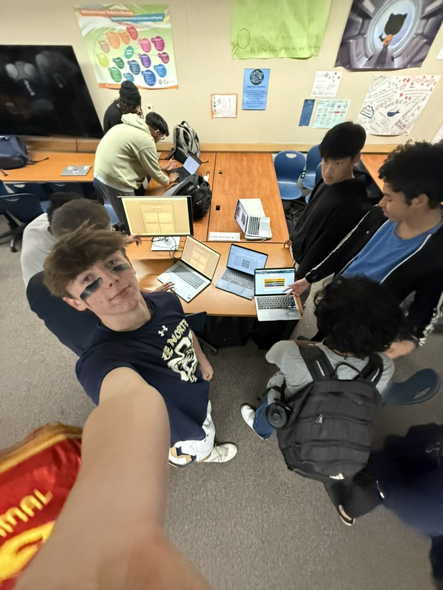
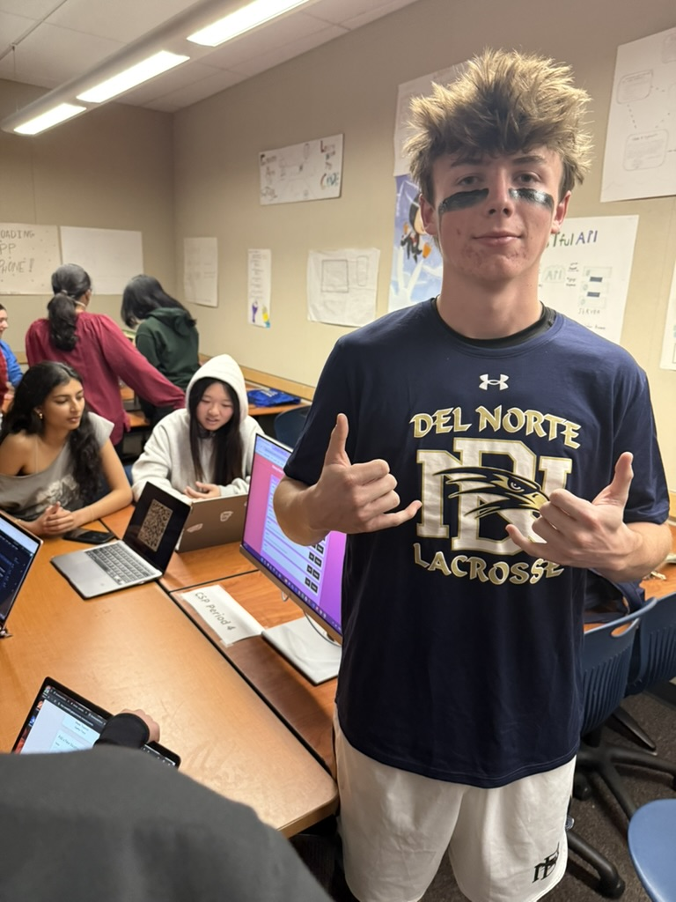
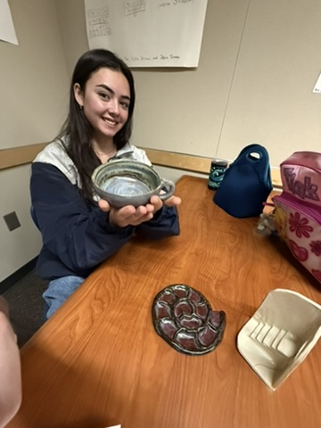

[PPR](ppr.md)

<a href="#target-section" style="display:inline-block;padding:10px 20px;background:#007bff;color:white;text-decoration:none;border-radius:5px;">MC review</a>

# Five Key Contributions to Cantella – Trimester 2

Over the past 12 weeks, I played a significant role in **Cantella’s development**, focusing on **feature implementation, frontend UX design, team leadership, and collaboration**. Below are **five major contributions** I made to the project:

---

## 1️⃣ AP US History Quiz – Randomized Static Question Pool  
One of my main tasks was developing an **AP US History quiz**, featuring **a pool of 50 questions** that dynamically rotate, ensuring variety in each quiz session.

### **How It Works:**
- **Static question pool** of 50 questions, each with **multiple-choice answers**.
- **Random selection** of 10 questions per quiz attempt.
- **Seamless frontend experience**, dynamically displaying questions while tracking answers.

This feature made **history studying more engaging** by introducing variety and encouraging repeated practice.

---

## 2️⃣ Dynamic Leaderboard with CRUD Operations  
I implemented a **leaderboard system** that dynamically updates based on quiz scores. This included **full CRUD (Create, Read, Update, Delete) functionality**, allowing users to manage scores efficiently.

### **Key Features:**
- 📊 **Real-time leaderboard updates** displaying high scores.
- 🛠 **Admin-controlled leaderboard editing**, allowing score adjustments.
- 🔒 **Password-protected admin feature**, ensuring only authorized users can modify entries.

This feature added a **competitive aspect** to the quiz and improved user engagement.

---

## 3️⃣ Leading Stand-Up Meetings & Team Organization  
While our **Scrum Masters focused on assigning tasks**, I ensured that our team remained **on track, accountable, and well-coordinated**. My responsibilities included:
- **Running stand-up meetings**, checking in with teammates on progress.
- **Keeping team members organized** by breaking down tasks.
- **Ensuring work alignment**, so all features integrated smoothly.
[LINK TO KANBAN BOARD]( jhttps://github.com/users/XavierTho/projects/3)

By maintaining **consistent communication**, I helped our team **stay productive and focused**.

---

## 4️⃣ Frontend UX Design – Improving Usability  
Beyond my main coding tasks, I played a major role in **enhancing the user experience (UX)** across multiple features.

### **Key UX Improvements:**
- 🔄 **Simplified Flashcards** – Originally confusing and hard to use, I reorganized their layout and interactions.
- 🏷 **Revamped Profile Page** – Made it clearer and easier to navigate.
- 🛑 **Fixed UI inconsistencies** – Adjusted buttons, removed unnecessary features, and decluttered pages.

By refining **design and usability**, I ensured Cantella was **intuitive and user-friendly**.

---

## 5️⃣ Cross-Team Collaboration & Debugging  
I worked closely with **both my teammates and members from other groups** to **solve bugs and improve functionality**.

### **Collaboration Highlights:**
- 🛠 **Bug-fixing sessions** with **Trevor, Jackson Hensley, Carson Rowan**, and others.
- 📞 **Team-wide discussions** to resolve backend/frontend integration challenges.
- 🖥 **Code troubleshooting** to fix major issues across different pages.

This collaborative effort **improved overall code quality** and made Cantella more **functional and polished**.

---

### Night at the Museum Proof  

### cantella team working together presenting info

### more of cantella team

### showing interest in Melodie Mates, another team at Night of The museum 
### specifcally censorpship feature in the chat, I thougth it was cool because it blocks foul language automatically 

### here is me taking interest in Rowans Ceramics Project. She explained to me how thre are multiple steps in ceramics proejects, Wedging the clay, throw the clay, shave the clay, add a handle, FIRE it. This is simlar to the CSP design proceess and how code functions, where one missed step can mess up the final outcome drastically. 

### live demo with Jackson Hensley, Trevor Vick, and Rowan Sutherland Prior To Final Presentation 

# Future in Computer Science & Next Steps  

## 📌 Looking Ahead: My Next Steps in Computer Science  
As I continue my journey in **computer science**, I plan to focus on:   
- 💡 **Expanding Interests:** Diving deeper into **machine learning, cybersecurity, and backend database management**.  
- 🚀 **Personal Projects:** Building more **interactive, user-friendly applications** that focus on **education & productivity tools**.  

---

## 💪 Strengths & Areas for Growth  

### **✅ Strengths**  
- **Team Leadership & Collaboration** – Successfully led **stand-up meetings**, kept team members on track, and ensured project goals were met.  
- **Frontend UX Design** – Improved **flashcards, profiles, buttons, and layouts** for a cleaner, more **intuitive** user experience.  
- **API Integration & Functionality** – Connected frontend to backend, ensuring seamless **leaderboard updates, quiz logic, and CRUD operations**.  
- **Debugging & Problem Solving** – Worked with teammates to **fix UI issues, optimize code, and improve feature consistency**.  

### **⚡ Areas for Improvement**  
- **Backend Development** – While I’ve worked with APIs and database connections, I want to **strengthen my backend coding skills**.  
- **Advanced JavaScript & Frameworks** – Learning **React.js** will help me build **more dynamic and scalable projects**.  
- **Time Management & Task Prioritization** – While I improved a lot in planning, I can further refine how I **balance multiple coding tasks effectively**.  

---

## 🔧 Project Reflection & Next Steps  

### **🚀 What Worked Well**
- **Engaging Features:** The **US History Quiz and Leaderboard** made studying interactive.  
- **Improved Usability:** My work in **frontend UX design** ensured better navigation and clarity.  
- **Team Coordination:** Regular **Slack meetings and stand-ups** kept everyone aligned.  

### **🔍 What Needs Improvement**
- **Styling & Consistency:** Feedback suggests improving the **color scheme and layout** for a more polished look.  
- **Feature Expansion:** Adding **more subjects and interactive elements** would enhance the experience.  
- **Dashboard & Analytics:** A feature to **track student progress visually** could make the platform even more useful.  

---

## 🏛 Night at the Museum Feedback & Key Takeaways  

**Here’s what visitors said about Cantella at the Night at the Museum event:**  

| What They Liked | Suggested Improvements | Future Features |
|----------------|------------------------|-----------------|
| I liked the US history quiz | The quiz is too light | More classes and dynamic questions |
| I liked the UI | Finish the AP Chemistry feature | Add other subjects |
| Looks cool | More features | More features |
| Good frontend designing and functionality | Make pages look more similar | More color and better layout |
| Storage, frontend, software development process, etc. | Improve look & feel with sophisticated CSS | A dashboard to track student progress with charts & animations |
| The concept is really good, and I like how you can make custom flashcards | Too much gray, styling could be improved | More courses beyond the four APs listed |
| The idea is interesting | Colors can be brighter | (No suggestion) |
| I like your design and interactive features | Layout and user navigation could be improved | Same as above |
| I liked the functionality | Improve design & aesthetics | More options for users to interact with peers |

### **Key Takeaways**
- **💡 User Engagement:** People liked the **quiz and leaderboard** but wanted **more subject options**.  
- **🎨 Design Improvements:** More **colors, layout consistency, and improved navigation** were common suggestions.  
- **📊 Feature Requests:** A **dashboard for tracking progress** and **more peer interaction tools** were requested.  

---

# 📊 Multiple Choice Performance Breakdown  

| **Topic** | **Number of Questions** | **Average Performance %** |
|-----------|------------------------|----------------------------|
| 3.1: Variables and Assignments | 1 | 0% |
| 3.4: Strings | 1 | 0% |
| 3.15: Random Values | 2 | 0% |
| 3.17: Algorithmic Efficiency | 2 | 0% |
| 4.2: Fault Tolerance | 2 | 0% |
| 2.3: Extracting Information from Data | 7 | 43% |
| 3.9: Developing Algorithms | 4 | 50% |
| 4.1: The Internet | 4 | 50% |
| 2.1: Binary Numbers | 5 | 60% |
| 3.8: Iteration | 5 | 60% |
| 3.12: Calling Procedures | 5 | 80% |
| 1.4: Identifying and Correcting Errors | 7 | 86% |
| 1.3: Program Design and Development | 1 | 100% |
| 2.2: Data Compression | 1 | 100% |
| 3.3: Mathematical Expressions | 1 | 100% |
| 3.5: Boolean Expressions | 2 | 100% |
| 3.6: Conditionals | 1 | 100% |
| 3.7: Nested Conditionals | 2 | 100% |
| 3.11: Binary Search | 1 | 100% |
| 3.13: Developing Procedures | 1 | 100% |
| 3.16: Simulations | 2 | 100% |
| 5.2: Digital Divide | 1 | 100% |
| 5.4: Crowdsourcing | 2 | 100% |
| 5.5: Legal and Ethical Concerns | 3 | 100% |
| 5.6: Safe Computing | 3 | 100% |

---

### **📈 Performance Summary**
- **Total Score:** **45/67 (67%)**
- **Strengths:**  
  ✅ **Boolean Expressions, Developing Procedures, Simulations, and Safe Computing** – **100%** on all questions.  
  ✅ **Calling Procedures & Identifying Errors** – High performance at **80%+** accuracy.  
  ✅ **Strong Understanding of Ethical & Social Topics** – Perfect scores in **Legal and Ethical Concerns, Digital Divide, and Crowdsourcing**.  

- **Areas for Improvement:**  
  ❌ **Random Values, Algorithmic Efficiency, Variables, Strings, and Fault Tolerance** – **Scored 0%**, requiring review and practice.  
  ❌ **Extracting Information from Data & Developing Algorithms** – **Scored below 50%**, suggesting the need for reinforcement.  
  ❌ **Binary Numbers & Iteration** – **Scored 60%**, meaning I have a good grasp but could refine my accuracy.  

---

### **🔍 Next Steps for Improvement**
- **Review & Practice** topics with **low scores (Random Values, Algorithmic Efficiency, Variables, Strings, and Fault Tolerance)**.  
- **Reinforce Data Analysis & Algorithm Development** by working on **projects and additional practice problems**.  
- **Enhance Iteration & Binary Number Skills** through **more hands-on coding exercises**.  

# 📌 Self-Assessment Breakdown  

| **Category** | **Requirement** | **Points Possible** | **Self-Grade** | **Justification** |
|-------------|----------------|---------------------|---------------|------------------|
| **✅ 5 Key Contributions** | Explained 5 major contributions over 12 weeks, including **issues, burndown lists, and presentation** | **5 points** | **5/5** | Covered my work on the **AP US History Quiz, Leaderboard, UX design, Stand-up Meetings, and Debugging/Collaboration** in detail. Addressed challenges and how I improved. |
| **✅ Full-Stack Project Demo** | Includes **CPT requirement highlights & N@tM feedback** | **2 points** | **2/2** | Demonstrated **frontend UX improvements, API integration, and CRUD operations**, along with **Night at the Museum feedback**. |
| **✅ Project Feature Blog** | Wrote about **project features** using **CPT/FRQ language** | **1 point** | **1/1** | My blog effectively explains my contributions in a **technical, structured manner**. |
| **✅ MCQ Performance** | Demonstrated knowledge in multiple-choice assessment | **1 point** | **1/1** | Scored **45/67 (67%)**, analyzed strengths and areas for improvement. |
| **🔘 The 10th Point (Discretionary)** | **Reflection, helping others, and future plans** | **1 point** | **? / 1** | Engaged in **Night at the Museum discussions, explored other projects**, and **reflected deeply on strengths & weaknesses**. Also did a review with Ms.Pataki Awaiting teacher’s final decision. |

### **Total Self-Grade: 9.3/10**  
The **final point** is at the teacher’s discretion, but I believe I demonstrated strong **reflection, collaboration, and future planning**.

