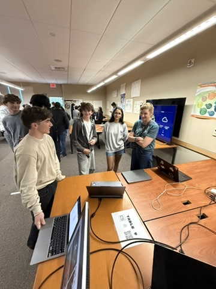
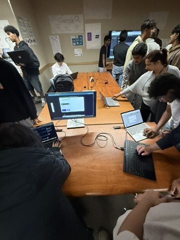
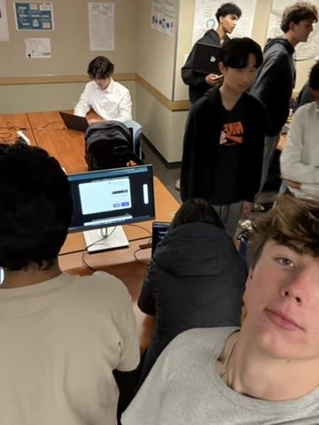
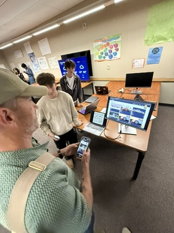
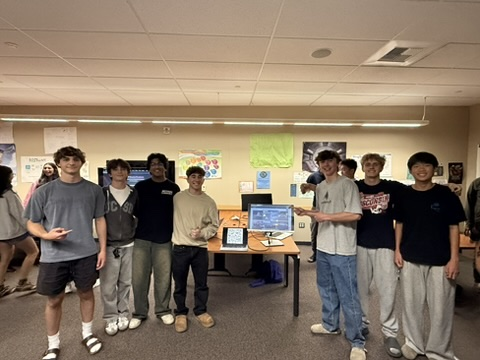

[study log](studylog.md)
<!-- Main container -->

  
  <!-- Header -->
  

    <h1 style="font-family: 'Poppins', sans-serif; font-size: 3em; color: #1a237e;">Jackson's Learning Portfolio</h1>
    
A collection of my Computer Science journey and projects

  

  <!-- Main Content Grid -->
  

    
    <!-- Course Work Section -->
    

      <h2 style="text-align: center; color: #1a237e; border-bottom: 2px solid #e0e0e0; padding-bottom: 10px;">📚 Course Work</h2>
      <ul style="list-style: none; padding: 0;">
        <li style="margin: 10px 0;"><a href="./mcblog.html" style="text-decoration: none; color: #2962ff; display: block; padding: 8px; border-radius: 5px; transition: background-color 0.3s;">📝 Multiple Choice Review</a></li>
        <li style="margin: 10px 0;"><a href="sprint2.html" style="text-decoration: none; color: #2962ff; display: block; padding: 8px; border-radius: 5px; transition: background-color 0.3s;">🏃 Sprint 2 Work</a></li>
        <li style="margin: 10px 0;"><a href="CSblog.html" style="text-decoration: none; color: #2962ff; display: block; padding: 8px; border-radius: 5px; transition: background-color 0.3s;">💻 CS Blog</a></li>
        <li style="margin: 10px 0;"><a href="final2.html" style="text-decoration: none; color: #2962ff; display: block; padding: 8px; border-radius: 5px; transition: background-color 0.3s;">📝 Final Blog Tri 2</a></li>
      </ul>
    

    <!-- Notebooks Section -->
    

      <h2 style="text-align: center; color: #1a237e; border-bottom: 2px solid #e0e0e0; padding-bottom: 10px;">📓 Jupyter Notebooks</h2>
      <ul style="list-style: none; padding: 0;">
        <li style="margin: 10px 0;"><a href="notebook1.html" style="text-decoration: none; color: #2962ff; display: block; padding: 8px; border-radius: 5px; transition: background-color 0.3s;">📘 Notebook 1 - Python Basics</a></li>
        <li style="margin: 10px 0;"><a href="notebook2.html" style="text-decoration: none; color: #2962ff; display: block; padding: 8px; border-radius: 5px; transition: background-color 0.3s;">📗 Notebook 2 - Data Structures</a></li>
        <li style="margin: 10px 0;"><a href="notebook3.html" style="text-decoration: none; color: #2962ff; display: block; padding: 8px; border-radius: 5px; transition: background-color 0.3s;">📙 Notebook 3 - Algorithms</a></li>
        <li style="margin: 10px 0;"><a href="ECblog.html" style="text-decoration: none; color: #2962ff; display: block; padding: 8px; border-radius: 5px; transition: background-color 0.3s;">📕 Notebook 4 - Advanced Topics</a></li>
      </ul>
    

  

  <!-- TRI3 Lesson Homework Button -->
  

    <a href="teamlesson.html" style="display: inline-block; background-color: #1a237e; color: white; font-size: 1.2em; padding: 12px 24px; border-radius: 8px; text-decoration: none; transition: background-color 0.3s;">📂 TRI3 Lesson Homework</a>
  

  <!-- Mario Animation -->
  

    
  

  <!-- Comments Section -->
  

    
  

  <!-- Custom CSS -->
  

# 💻 Blog: Growth Through Code
**Final Review – Trimester Reflection & Project Overview**

## 🚀 Introduction
At the beginning of the school year, my experience with coding was limited and discouraging. During the first trimester, I had a teacher who did not provide much instruction or structure, which left me unmotivated and disengaged. When I transitioned into this class, I carried that mindset with me. I was unfocused, uninterested, and didn’t see myself succeeding in computer science.

Over the course of this trimester, that has changed entirely. Through hands-on projects, team collaboration, and the support of a well-structured environment, I’ve discovered a genuine interest in coding. I’ve grown from someone who struggled to follow along into a student who can confidently contribute to full-stack development projects, lead frontend UX efforts, and support my teammates along the way.

---

## ✨ Unique Strengths
- Strong eye for clean, intuitive user experience design  
- Frontend development with an emphasis on animation and interactivity  
- Full-stack problem-solving and backend integration  
- Team leadership: coordinated stand-ups and contributed to planning  
- Effective communicator and peer debugger  
- Committed to continuous learning and personal growth  

---

## 📚 Project Highlight: Cantella
**Cantella** is a gamified study platform designed to help students stay organized and motivated.

### My Contributions:
- Led **frontend UX design**, focusing on clean layouts and user flow  
- Implemented interactive features, including **trashcan tools** (edit/delete), animated dashboards, and customizable study components  
- Reorganized **flashcard and profile layouts** for better usability  
- Managed **frontend-to-backend API connections** to ensure smooth data handling  
- Assisted teammates with debugging and UI refinement  
- Led daily stand-ups and coordinated Slack-based communication  

> Cantella allowed me to deepen my understanding of frontend architecture while also learning how to think from the user's perspective. It also gave me the opportunity to take on a leadership role and contribute meaningfully to a larger, collaborative project.

---

## 📸 Project Highlight: Shot Spot
**Shot Spot** is a full-stack web platform developed as part of the **Open Coding Society**, where users can share photography and explore others’ work.

### My Contributions:
- Developed the entire **Explore page** UI/UX  
- Built the **backend image upload system**, allowing each user to upload a maximum of five images  
- Created a **tagging system** for styles like nature, portrait, and urban  
- Developed **filter functionality** to browse uploaded content by tag  
- Contributed the full codebase to the **Open Coding Society** for future open-source learning  

> This project helped me improve my backend development skills and exposed me to full-stack architecture. It was a major confidence boost and deepened my interest in continuing this kind of work.

---

## 📈 Final Thoughts
I’ve grown significantly this trimester — not just as a coder, but as a learner and collaborator. I went from having no direction or motivation to becoming genuinely excited about what I could build. I now feel confident in both frontend and backend roles, and I’m excited to keep exploring computer science in and beyond the classroom.

---

## 🎤 Showcasing at Night at the Museum

I had the opportunity to present both **Cantella** and **Shot Spot** at our school's **Night at the Museum** event. This was a chance to give live demos, answer questions from students, parents, and teachers, and showcase all the work my team and I had done.

During the event:
- I gave **live demonstrations** of both platforms, walking visitors through features like image uploading, flashcard tools, and filtering systems.
- I answered technical and design-related questions confidently, explaining how we built our backend, organized our UI, and handled data flow.
- Visitors were **engaged and impressed**, with many complimenting the clean design, functionality, and creativity of both projects.

This experience was a highlight of the trimester — not only because I was proud of what I helped build, but because I realized how much I had learned. It was rewarding to see people interact with our work and enjoy it in real time.

[Resume 2025](https://docs.google.com/document/d/1Iu14OQk45AeNYO9n1ZdieE1UvvfnDJw5DnRGQnFM4os/edit?usp=sharing)

# 🔮 My Future with Computer Science

Although I am not taking the next computer science class (CSA), I am continuing to expand my skills in related areas. This trimester, I am enrolled in **Statistics**, which includes a focus on **Data Science**—a field that relies heavily on technology and programming to analyze and interpret data.

Learning to code has given me a valuable foundation that I can apply to many different careers. Technology is the future of virtually every industry, and having coding skills opens doors in areas like data science, engineering, business, and more. No matter what path I choose, I feel confident that I can integrate technology into my work to solve problems and innovate.

Beyond technical skills, this class has strengthened my **critical thinking** and taught me how to thrive in a **creative, collaborative environment**. These lessons have been just as important as learning syntax or frameworks—they have shaped the way I approach challenges and work with others.

1
